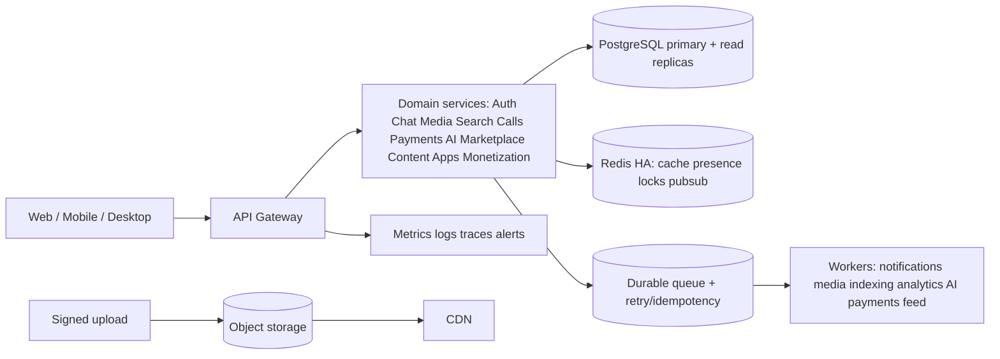

# DAILY Production Infrastructure & DevOps 2.0

## Architecture

## Services

DAILY uses domain-based services rather than unnecessary fragmentation: API Gateway, Auth/User, Chat/Message, Media, Notifications, Search, Call/Signaling, Payments, AI, Marketplace, Content, Bot/Mini App, Monetization, and Moderation. Each service owns a clear contract and emits correlation-ID-bearing events.

## Reliability

The queue is durable, idempotent, and retry-aware. PostgreSQL uses pooling, indexes, read replicas, automated backups, and point-in-time recovery. Redis is treated as HA infrastructure for cache, presence, rate limits, distributed locks, pub/sub, and temporary state rather than a single-node dependency. Object storage uses signed uploads, processing queues, CDN cache-control, and invalidation.

## Containers and Kubernetes

`infra/Dockerfile` is multi-stage, non-root, read-only-rootfs compatible, and health checked. `docker-compose.production.yml` provides a production-like local stack with API, worker, PostgreSQL, and Redis. `infra/k8s/daily.yaml` provides rolling Deployment, Service, Ingress, Config/Secret reference, HPA, PDB, resource limits, readiness, and liveness probes. Replace image and host placeholders through deployment configuration.

## CI/CD and zero downtime

The GitHub Actions pipeline runs lint, build, audit, image build, staging deployment, health/smoke checks, and controlled production promotion. Production requires an environment reviewer. Releases use backward-compatible migrations, rolling updates, graceful shutdown, connection draining, WebSocket reconnect, immutable images, and rollback to the previous image.

## Observability and health

Every service exposes `/health`, `/ready`, and `/live`. Metrics include request latency, errors, queue depth/latency, WebSocket connections, database performance, cache hit rate, media processing, and provider errors. Logs and traces carry correlation IDs across HTTP, WebSocket, and queue events.

## Disaster recovery and cost control

Use multi-zone application deployment, redundant object storage, automated backup verification, documented RPO/RTO, and tested recovery procedures. Budget alerts track CPU, memory, storage, bandwidth, database, queue, and CDN consumption. Secrets are injected from a managed secret store; no production credential belongs in Git.

## Scale plan

Start with 3 API replicas and HPA, then scale by CPU/memory, request rate, WebSocket count, and queue depth. At 10K/100K concurrent connections, shard gateway/WebSocket presence and use regional Redis/queue partitions. For million-scale planning, isolate hot domains, partition event streams, use read replicas/search clusters, CDN all media, and run regular reconnect-storm and feed-load benchmarks with `scripts/load-test.js`.

## Incident response

On alert: assign incident owner, freeze risky releases, inspect correlation IDs and dependency health, protect data, communicate impact, mitigate or rollback, verify recovery, then write a postmortem with corrective actions. Admin and production actions require least privilege, audit logs, and sensitive-action review.
